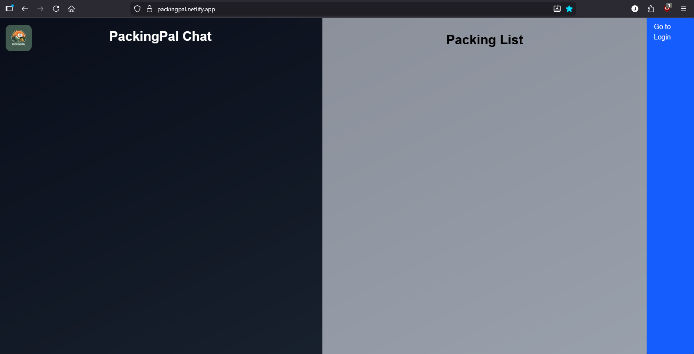
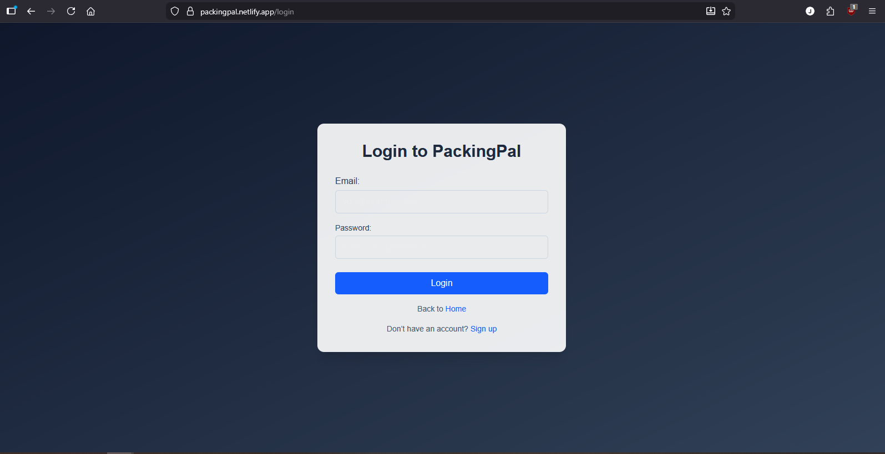

# PackingPal — User Guide and Manual

## Welcome to PackingPal
**What is PackingPal?** PackingPal is your personal packing assistant! Whether you're planning a camping trip, weekend getaway, or any adventure, PackingPal helps you create the perfect packing list. The app features a friendly chatbot that can answer your questions about what to pack and generates customized packing lists based on your needs.

**Who should use this guide?** This guide is written for anyone who wants to use PackingPal to create and manage packing lists for camping trips. You don't need any technical knowledge, just a web browser and an internet connection.

## Getting Started

### Accessing PackingPal
Simply visit https://packingpal.netlify.app/ in your web browser (Chrome, Firefox, Safari, Edge, etc.). The site will load automatically, no installation needed!

## Creating Your Account

### Sign Up
1. From the Home page, click the **"Go to Login"** button in the top-right corner.

2. On the Login page, look for the link that says **"Sign up"** at the bottom.

3. Click **"Sign up"** to go to the account creation page. (Note: Work in Progress)
4. Enter the following information:
   - **Email:** Your email address (this is how you'll log in later)
   - **Password:** Create a secure password
   - **Confirm Password:** Re-enter your password to make sure it's correct
5. Click the **"Sign Up"** button to create your account.

### Logging In
1. Visit https://packingpal.netlify.app/ and click **"Go to Login"** in the top-right corner.
2. Enter your email and password.
3. Click the **"Login"** button.
4. You'll be taken to the Home page where you can start creating packing lists!

## Main Pages and Features
**Home: PackingPal Chat and Packing List**
    - **Left Column: PackingPal Chat**: This is where you'll interact with our helpful chatbot. You can ask questions about what to pack, get packing tips, or request a packing list for a specific trip.
    - **Right Column: Packing List**: Your custom packing list will appear here, which you can save to your account when it is completed to your liking.
    - **Top-Right Corner:** Link to the Login page (or your account menu once you're logged in)

## How to Use (Quick Start)

### Creating Your First Packing List
1. Log in to your account.
2. On the Home page, click in the **PackingPal Chat** window (left side) and say something like:
   - "I'm going camping for 3 days in the mountains" 
   - "Help me pack for a beach trip"
   - "What should I bring for a hiking weekend?"
3. Our chatbot will ask you a few quick questions to understand your trip better (weather, duration, activities, etc).
4. Based on your answers, PackingPal will generate a customized packing list in the **Packing List** area.

### Editing Your Packing List
- You can add items to your list by asking the chatbot, or manually typing in the chat.
- Remove items you don't need by asking the chatbot to remove them.
- Your list is automatically saved to your account, so you can return to it anytime.

## Tips and Best Practices

- **Be specific with the chatbot:** The more details you provide about your trip (duration, location, activities, season), the better your packing list will be.
- **Ask follow-up questions:** Don't hesitate to ask the chatbot "What else should I bring?" or "Is this necessary for a camping trip?"
- **Save multiple lists:** You can create different packing lists for different trips. Just log in, and all your lists will be available.

## Frequently Asked Questions (FAQ)

### Account & Login

**Q: Do I need an account to use PackingPal?**
A: Yes, you'll need to create an account to save your packing lists. This ensures that your lists are safely stored and available whenever you log in. Creating an account is quick and free!

**Q: How do I reset my password if I forget it?**
A: Currently, we don't have a password reset feature. If you forget your password, please create an issue on the PackingPal repository located at https://github.com/AidenFrank/PackingPal. We are actively working on adding a "Forgot Password" feature to make this easier.

**Q: Is my personal information safe?**
A: Yes! We take your privacy seriously. Your email and password are securely stored, and we don't share your personal information with third parties.

**Q: Can I delete my account?**
A: Yes, you can contact our support team to request account deletion. Your data will be permanently removed from our system.

### Using the Chat and Packing Lists

**Q: Can the chatbot help me pack for any type of trip?**
A: Not currently. PackingPal's chatbot will ideally be designed to help with many types of trips: camping, hiking, beach vacations, city trips, business travel, and more. However, we are currently focusing on camping trips in the testing phase and plan to branch out once testing is complete.

**Q: How detailed should my packing list be?**
A: That's up to you! You can have a simple, high-level list (clothes, toiletries, gear) or a very detailed list with specific items. You can always ask the chatbot to add more details or simplify the list.

**Q: Can I edit the packing list after it's generated?**
A: Yes! You can check off items, ask the chatbot to add or remove items, or manually modify your list as needed.

**Q: Will my packing lists be saved if I log out?**
A: Yes! All your lists are saved to your account. When you log back in, your lists will be right where you left them.

**Q: Can I create multiple packing lists?**
A: Yes! You can create as many lists as you need. Each list is independent.

**Q: How do I delete a packing list?**
A: Currently, you can clear the items from a list in the chat by asking the chatbot to remove them. In a future update, we'll add a delete button for easier list management.

### Technical Questions

**Q: What browsers does PackingPal work on?**
A: PackingPal works on all modern browsers, including Chrome, Firefox, Safari, and Edge. For the best experience, use the latest version of your browser.

**Q: Do I need to download anything to use PackingPal?**
A: No! PackingPal is a web app, so it works entirely in your browser. There's nothing to download or install.

**Q: Can I use PackingPal on my phone or tablet?**
A: Yes! PackingPal is designed to work on phones, tablets, and computers. Just visit https://packingpal.netlify.app/ in your browser. With that being said, we are currently optimizing for computers.

**Q: What if the website is loading slowly?**
A: Try these steps:
  1. Refresh the page (press F5 or Command+R on Mac).
  2. Clear your browser's cache and cookies, then try again.
  3. Check your internet connection.
  4. If the problem persists, it may be a temporary issue with our servers. Try again in a few minutes.

**Q: What if I see an error message?**
A: Here are some common issues and how to fix them:
  - **"Email already in use"** — This email is already registered. Try logging in instead, or use a different email address.
  - **"Passwords do not match"** — The password and confirm password fields don't match. Make sure you typed both correctly.
  - **Page won't load** — Refresh the page or clear your browser cache (instructions above).

### Getting Help

**Q: Who do I contact if I have more questions?**
A: Please reach out to our support team on GitHub (@AidenFrank, @moniesco22, and @jessicacvetkovska) or visit https://github.com/AidenFrank/PackingPal and create an issue. We're here to help!

**Q: Can I suggest new features or report bugs?**
A: We'd love your feedback! Please add an issue at our GitHub repository https://github.com/AidenFrank/PackingPal with any suggestions or issues you encounter. Your input helps us improve PackingPal.

## Troubleshooting

### Common Issues

**Issue: I can't create an account**
- Make sure you're using a valid email address.
- Check that your password and confirm password match exactly (passwords are case-sensitive).
- Ensure you've entered all required fields.

**Issue: I can't log in**
- Double-check that you've entered your email and password correctly.
- Remember that passwords are case-sensitive.

**Issue: The page won't load**
- Refresh your browser.
- Check your internet connection.
- Clear your browser cache.

**Issue: The chat isn't responding**
- Make sure you're logged in to your account.
- Try refreshing the page.
- Check that your internet connection is stable.

## Future Features

PackingPal is actively being developed! Here are some exciting features coming soon:

- **Smart packing suggestions** based on weather forecasts for your destination
- **Sharing packing lists** with friends and family
- **Template lists** for common trip types (camping, beach, business, etc.)
- **Offline access** to your packing lists
- **Integration with weather apps** to get real-time recommendations
- **"What to pack" tips and articles** from experienced travelers

## About This Guide

This guide covers the basics of using PackingPal. As the app grows and new features are added, we'll update this documentation to keep it current. 

**Have feedback on this guide?** Let us know! We want to make sure our documentation is clear and helpful. Contact us on our GitHub page at https://github.com/AidenFrank/PackingPal and create an issue!

**Last Updated:** February 2026
**PackingPal Version:** 1.0 (Current)